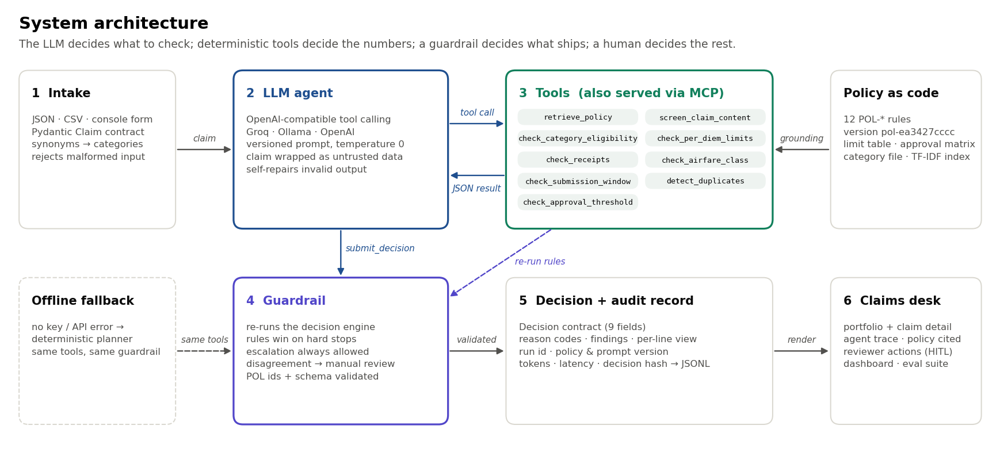
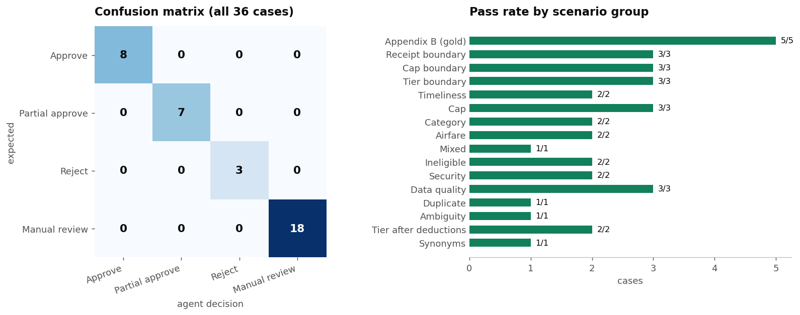

<div align="center">

# Travel Reimbursement Approval Agent

**A policy-grounded, tool-calling GenAI agent that adjudicates employee travel claims, explains every dollar, and knows when to hand a case to a human.**


**Deliverable: [`priyanshuverma.ipynb`](priyanshuverma.ipynb)**. It is a single notebook containing the README, code, evaluation, dashboard, interactive console, design notes and final JSON.

</div>


## Results

| Claim | Decision | Approved | Deducted | Deciding factor |
|:--|:--|--:|--:|:--|
| CLM-001 | APPROVE | $1,110 | $0 | Fully compliant, manager tier (POL-APR-02) |
| CLM-002 | REJECT | $0 | $380 | Spa and minibar are never reimbursable (POL-CAT-02) |
| CLM-003 | PARTIAL_APPROVE | $840 | $100 | Hotel $250/night over the $200 cap (POL-PD-02) |
| CLM-004 | MANUAL_REVIEW | – | – | Business class, missing receipt, above $2,000, nights conflict |
| CLM-005 | MANUAL_REVIEW | – | – | Missing receipt; group meal against a per-person cap |

## What is inside

| Layer | What it does |
|---|---|
| **Contracts** | Pydantic models validate the claim on intake and the 9-field decision on exit |
| **Policy as code** | 12 `POL-*` rules with ids, effects and text; a content-hashed policy version is stamped on every decision |
| **Grounding** | Hybrid retrieval (exact id + TF-IDF) with its own evaluation (hit@3 = 100%) |
| **9 tools** | Eligibility, per-diem caps, receipts, airfare class, timeliness, duplicates, approval tier, policy retrieval, prompt-injection and data-quality screening |
| **Agent** | OpenAI-compatible tool-calling loop (Groq, Ollama or OpenAI). The claim is passed as untrusted data, required checks are enforced in code, and invalid output is sent back for self-repair. Every step is traced |
| **Guardrail** | Reconciles the LLM with the rule engine; it can escalate, never de-escalate |
| **Audit** | Run id, model, prompt and policy versions, tokens, latency, spans and a decision hash, written to `audit_log.jsonl` |
| **Evaluation** | 36 scenarios: gold claims, every boundary, conflicts, duplicates, injections. **36/36 pass, 0 unsafe auto-decisions** |
| **MCP** | The same tool registry served over the Model Context Protocol, with a parity test against direct calls |
| **Human in the loop** | Reviewer queue with priority, owner and SLA, plus documents to request and a drafted employee message |
| **Claims desk** | Interactive review console (anywidget): portfolio, itemised receipt with decision stamp, findings, agent trace, policy cited, JSON output, new or edited claims, reviewer actions |


## Quick start

```bash
pip install -r requirements.txt
export GROQ_API_KEY="gsk_..."          # optional; free key from console.groq.com
jupyter lab priyanshuverma.ipynb       # Run → Run All Cells
```

Without a key, the notebook still runs end to end. A deterministic planner calls the same tools through the same guardrail, and every result is labelled with the engine that produced it.

To browse a read-only preview of the console without Jupyter, open `review_console.html` in a browser.

## Architecture




